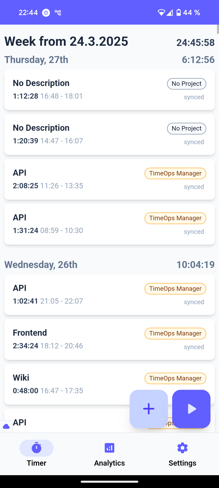
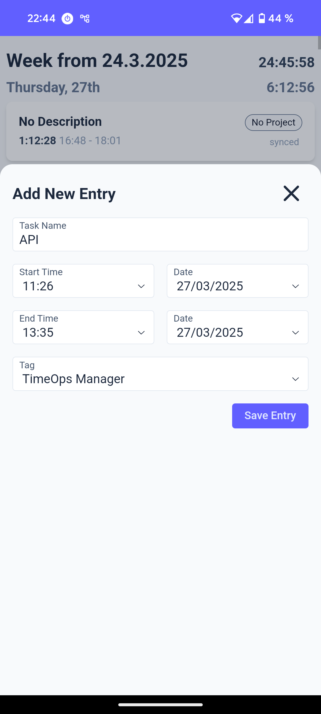
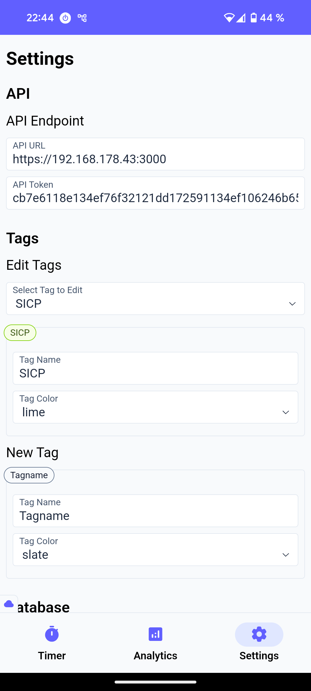
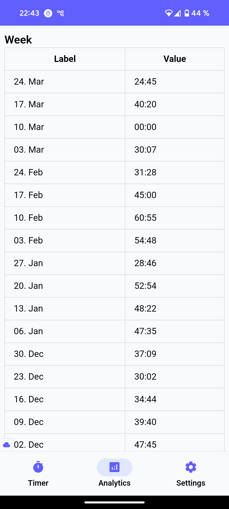
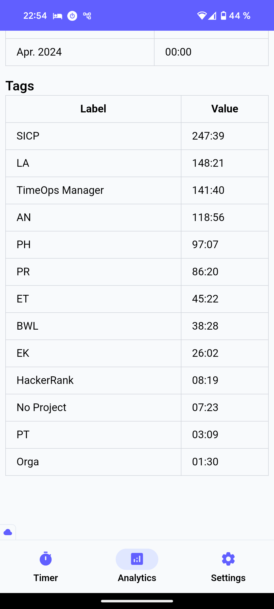

# TOC

- [TOC](#toc)
- [Overview](#overview)
- [Setup](#setup)
  - [WSL](#wsl)
    - [.wslconfig](#wslconfig)
  - [HTTPS](#https)
    - [Server-Side](#server-side)
    - [Client-Side](#client-side)
- [Screenshots](#screenshots)

# Overview

- [Live Preview](https://tomsoerr.github.io/TimeOps-Manager-Webapp/) (only offline)
- [TimeOps Manager API](https://github.com/TomSoerr/TimeOps-Manager-Backend)
- [TimeOps Manager API Wiki](https://github.com/TomSoerr/TimeOps-Manager-Backend)


```
├── public                             # Static assets served directly to client
│   ├── apple-touch-icon.png           # Icon for iOS home screen
│   ├── desktop-screenshot.png         # Screenshot for PWA install on desktop
│   ├── favicon-96x96.png              # Browser favicon
│   ├── maks-icon.svg                  # SVG icon for masks
│   ├── mobile-screenshot.png          # Screenshot for PWA install on mobile
│   ├── pwa-192x192.png                # Small PWA icon
│   └── pwa-512x512.png                # Large PWA icon
├── src                                # Application source code
│   ├── constants                      # App-wide constant values
│   │   ├── global.ts                  # Global application constants
│   │   └── tags.ts                    # Tag-related constants
│   ├── context                        # React context providers
│   │   └── ConnectionContext.tsx      # Manages online/offline state
│   ├── database                       # Database related code
│   │   ├── services                   # Database CRUD operations
│   │   │   ├── analytics.ts           # Analytics data queries
│   │   │   ├── entries.ts             # Time entry operations
│   │   │   ├── running.ts             # Currently running entry operations
│   │   │   ├── sync.ts                # Data synchronization logic
│   │   │   └── tags.ts                # Tag management operations
│   │   ├── utils                      # Database utility functions
│   │   │   └── api-helpers.ts         # API connection helpers
│   │   ├── db-instance.ts             # Database instance initialization
│   │   ├── index.ts                   # Database exports
│   │   └── schema.ts                  # Database schema definitions
│   ├── features                       # Feature modules
│   │   ├── analytics                  # Analytics feature
│   │   │   └── Analytics.tsx          # Analytics page component
│   │   ├── entries                    # Time entries feature
│   │   │   ├── EntryForm.tsx          # Form for creating/editing entries
│   │   │   ├── EntryModal.tsx         # Modal dialog for entry form
│   │   │   └── types.ts               # Entry-related type definitions
│   │   ├── settings                   # Settings feature
│   │   │   ├── components             # Settings UI components
│   │   │   ├── hooks                  # Settings-related hooks
│   │   │   └── pages                  # Settings pages
│   │   ├── tags                       # Tag management feature
│   │   │   ├── EditTags.tsx           # Tag editing component
│   │   │   └── TagForm.tsx            # Form for creating/editing tags
│   │   └── timer                      # Timer feature
│   │       ├── components             # Timer UI components
│   │       ├── hooks                  # Timer-related hooks
│   │       └── pages                  # Timer pages
│   ├── services                       # External services
│   │   └── sseService.ts              # Server-sent events service
│   ├── types                          # TypeScript type definitions
│   │   ├── color.types.ts             # Color-related types
│   │   ├── database.types.ts          # Database model types
│   │   └── tags.ts                    # Tag-related types
│   ├── ui                             # Reusable UI components
│   │   ├── buttons                    # Button components
│   │   ├── entries                    # Entry display components
│   │   ├── feedback                   # User feedback components
│   │   ├── inputs                     # Form input components
│   │   ├── layout                     # Layout components
│   │   ├── navigation                 # Navigation components
│   │   ├── Icon.tsx                   # Icon component
│   │   └── Tag.tsx                    # Tag display component
│   ├── utils                          # Utility functions
│   │   ├── entryToCard.tsx            # Converts entries to card components
│   │   ├── groupEntries.ts            # Groups entries by time periods
│   │   ├── ScrollToTop.tsx            # Scroll restoration component
│   │   └── time.ts                    # Time manipulation utilities
│   ├── index.css                      # Global CSS styles
│   └── index.tsx                      # Application entry point
├── eslint.config.js                   # ESLint configuration
├── index.html                         # HTML entry point
├── package.json                       # NPM dependencies and scripts
├── package-lock.json                  # Locked NPM dependencies
├── prettierrc.json                    # Prettier code formatter config
├── README.md                          # Project documentation
└── vite.config.ts                     # Vite bundler configuration
```

# Setup

## WSL

```powershell
sudo netsh interface portproxy add v4tov4 listenport=5173 listenaddress=0.0.0.0 connectport=5173 connectaddress=172.20.124.2

# install and enable Hyper-V for WSL2 bridge
Get-WindowsOptionalFeature -Online -FeatureName Microsoft-Hyper-V
Enable-WindowsOptionalFeature -Online -FeatureName Microsoft-Hyper-V -All

# List network adapters
Get-NetAdapter | Select-Object Name, InterfaceDescription

# Create new external virtual switch
New-VMSwitch -Name "WSL_Bridge" -NetAdapterName "Wi-Fi" -AllowManagementOS $true

# into .bashrc
sudo ip addr flush dev eth0
sudo ip addr add 192.168.178.43/24 dev eth0
sudo ip route add default via 192.168.178.1 dev eth0
```

### .wslconfig

Inside user home folder:
```ini
[wsl2]
networkingMode=bridged
vmSwitch="WSL_Bridge"
dhcp=true
```

## HTTPS

### Server-Side

```sh
# 1. Install mkcert if not already installed
# On Ubuntu/Debian:
# sudo apt install mkcert

# 2. Create certificates inside project folder
mkcert -install
mkcert 192.168.178.43  # Use your server's IP address

# 3. Find the location of your root CA certificate
mkcert -CAROOT

# 4. Convert certificate to CRT format (for Android and Windows clients)
openssl x509 -in "192.168.178.43.pem" -out rootCA.crt

```

### Client-Side

```sh
# 1. Copy the certificate files from WSL to Windows if needed
# Example: \\wsl$\Ubuntu\path\to\project\192.168.178.43.pem

# 2. Add certificate to Windows trust store (run as Administrator)
certutil -addstore -f "ROOT" "192.168.178.43.pem"

# 3. Configure port forwarding for the application

# List current port proxy settings
netsh interface portproxy show all

# Remove any conflicting port proxy settings
netsh interface portproxy delete v4tov4 listenport=5173 listenaddress=0.0.0.0

# Add new port proxy settings
netsh interface portproxy add v4tov4 listenport=5173 listenaddress=0.0.0.0 connectport=5173 connectaddress=192.168.178.43

# For API server port
netsh interface portproxy add v4tov4 listenport=3000 listenaddress=0.0.0.0 connectport=3000 connectaddress=192.168.178.43
```

# Screenshots





